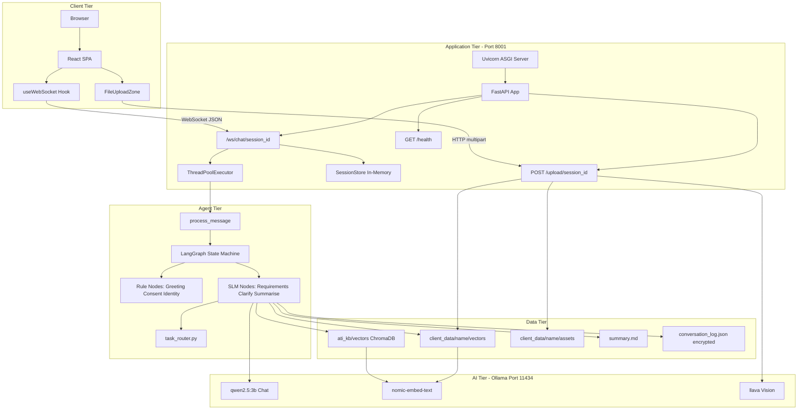
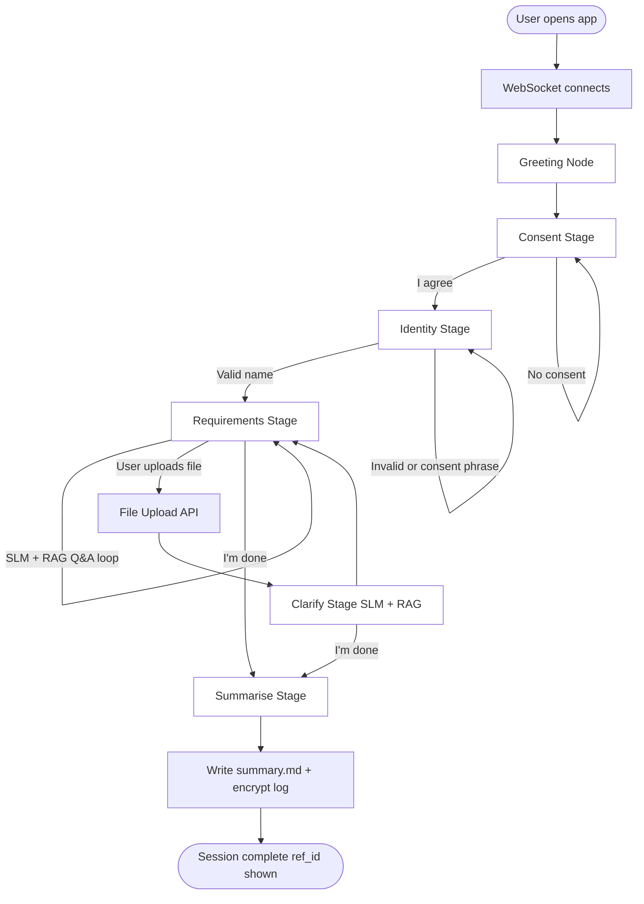
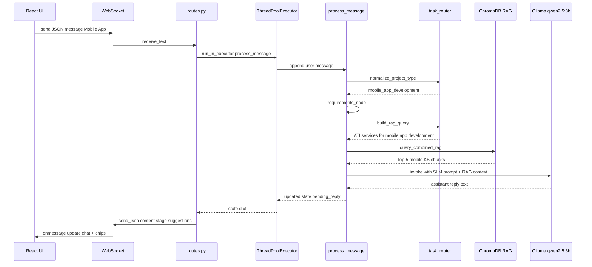
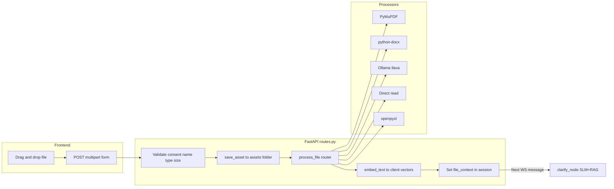
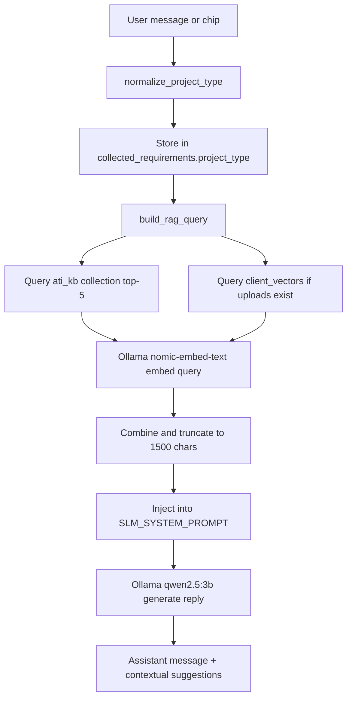
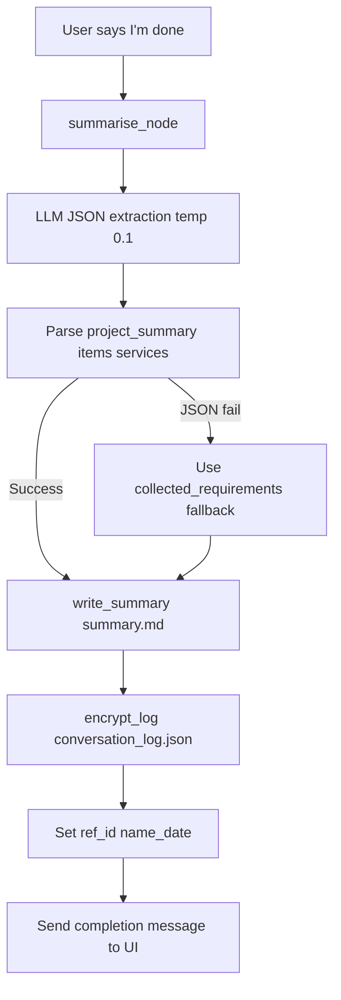
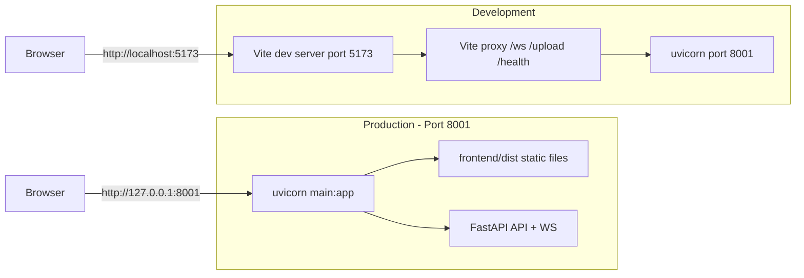
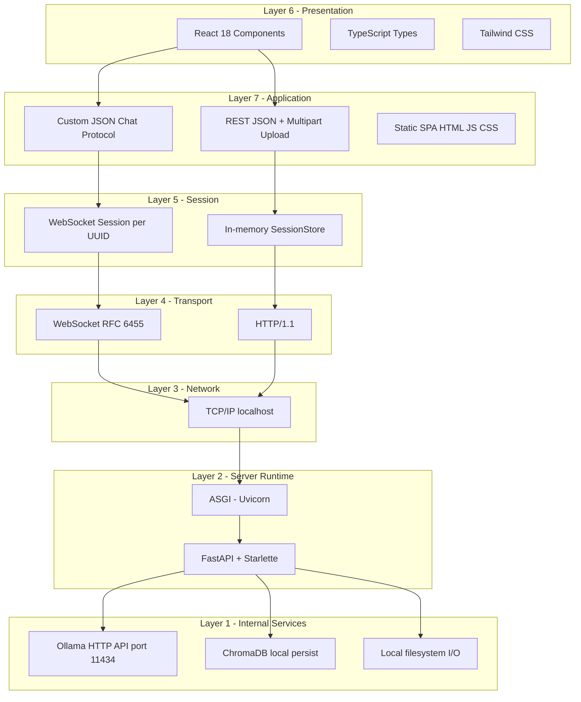

# ATI Client Onboarding AI Chatbot — Implementation Reference

**Version:** 3.2.0  
**Project path:** `ati-onboarding-bot/`  
**Purpose:** AI-powered client onboarding for Awesome Technologies Inc. (ATI). Gathers project requirements through conversation, accepts file uploads, and generates structured client briefs — **100% local, no paid API keys**. Includes a multi-tenant **admin platform** with RBAC, SaaS workspace settings, and runtime AI/system configuration.

---

## Table of Contents

1. [Executive Summary](#1-executive-summary)
2. [Architecture Overview](#2-architecture-overview)
3. [Complete System Flowchart](#3-complete-system-flowchart)
4. [Protocol Stack](#4-protocol-stack)
5. [Technology Stack](#5-technology-stack)
6. [Project Structure](#6-project-structure)
7. [Configuration](#7-configuration)
8. [Backend — FastAPI Application](#8-backend--fastapi-application)
9. [Agent Pipeline (LangGraph)](#9-agent-pipeline-langgraph)
10. [LLM Layer — Ollama](#10-llm-layer--ollama)
11. [RAG — ChromaDB Knowledge Base](#11-rag--chromadb-knowledge-base)
12. [File Processing](#12-file-processing)
13. [Storage & Client Data](#13-storage--client-data)
14. [Frontend — React/Vite SPA](#14-frontend--reactvite-spa)
15. [API & WebSocket Protocol](#15-api--websocket-protocol)
16. [Scripts & Operations](#16-scripts--operations)
17. [Testing](#17-testing)
18. [Evolution & Bug Fixes](#18-evolution--bug-fixes)
19. [v3 Architecture (Auth, MongoDB, Bootstrap UI)](#19-v3-architecture-auth-mongodb-bootstrap-ui)
20. [v3.1 Architecture (UI, Quality, Learning)](#20-v31-architecture-ui-quality-learning)
21. [v3.2 Admin Platform & RBAC](#21-v32-admin-platform--rbac)
22. [v3.8 Admin UX & SaaS Settings](#22-v38-admin-ux--saas-settings)
23. [Roadmap](#23-roadmap)

---

## 1. Executive Summary

The ATI Onboarding Chatbot guides prospective clients through a six-stage onboarding flow:

| Stage | Method | AI Used |
|-------|--------|---------|
| Greeting | Rule-based | None |
| Consent | Rule-based | None |
| Identity (name capture) | Rule-based | None |
| Requirements | SLM + RAG | Ollama `qwen2.5:3b` + ChromaDB |
| Clarify (post-upload) | SLM + RAG | Ollama `qwen2.5:3b` + ChromaDB |
| Summarise | SLM + RAG | Ollama `qwen2.5:3b` + ChromaDB |

Additional AI capabilities:

| Capability | Model |
|------------|-------|
| Embeddings (RAG indexing/retrieval) | `nomic-embed-text` |
| Image description (uploads) | `llava` |
| PDF/DOCX/TXT/XLSX parsing | Rule-based libraries (no LLM) |

**Key design decisions:**

- **One stage per user message** — prevents consent/name chaining bugs.
- **ThreadPoolExecutor** for agent steps — avoids blocking the async event loop during Ollama calls.
- **Fully local Ollama** — replaced Gemini API (quota/cost issues).
- **Project-type-aware RAG** — mobile app selections retrieve mobile KB sections, not mortgage content.
- **Bootstrap HTML/JS UI** — ChatGPT-style sidebar chat; React `frontend/` deprecated.
- **Login-first auth** — JWT httpOnly cookies; email/password + Google OAuth.
- **MongoDB Atlas** — users, sessions, briefs, roles, tenants, audit, config; ChromaDB + files stay on local disk.
- **Admin platform (v3.2)** — dashboard KPIs, RBAC (modules/pages/actions/roles), AI vs system config split, SaaS workspace (API keys, usage, audit).

---

## 2. Architecture Overview

```
┌─────────────────────────────────────────────────────────────────────────┐
│                         Browser (React SPA)                              │
│  ProgressStepper · QuickReplies · ConsentCard · FileUploadZone · Chat   │
└───────────────────────────────┬─────────────────────────────────────────┘
                                │ WebSocket /ws/chat/{id}
                                │ HTTP POST /upload/{id}
                                ▼
┌─────────────────────────────────────────────────────────────────────────┐
│                    FastAPI (main.py, port 8001)                          │
│  routes.py · session_store · ThreadPoolExecutor · /health               │
└───────────────────────────────┬─────────────────────────────────────────┘
                                │
        ┌───────────────────────┼───────────────────────┐
        ▼                       ▼                       ▼
┌───────────────┐     ┌─────────────────┐     ┌─────────────────┐
│  LangGraph    │     │  ChromaDB RAG   │     │  Ollama (local) │
│  Agent Nodes  │────▶│  ati_kb/vectors │────▶│  qwen2.5:3b     │
│  6 stages     │     │  client/vectors │     │  nomic-embed    │
└───────────────┘     └─────────────────┘     │  llava          │
        │                                       └─────────────────┘
        ▼
┌─────────────────────────────────────────────────────────────────────────┐
│  client_data/{ClientName}/                                               │
│    assets/ · vectors/ · summary.md · conversation_log.json · .enc       │
└─────────────────────────────────────────────────────────────────────────┘
```

---

## 3. Complete System Flowchart

This section documents the full end-to-end behaviour of the system — from browser load to brief generation.

### 3.1 High-Level Component Flow



### 3.2 Onboarding Stage Flow (User Journey)

Each user message advances **exactly one stage** — no multi-stage chaining.



| Stage | Handler | Uses AI? | Key output |
|-------|---------|----------|------------|
| Greeting | `greeting_node` | No | Consent message |
| Consent | `consent_node` | No | `consent_given = true` |
| Identity | `identity_node` | No | `client_name`, workspace folder |
| Requirements | `requirements_node` | Yes SLM+RAG | Next question, `collected_requirements` |
| Clarify | `clarify_node` | Yes SLM+RAG | Follow-up on uploaded file |
| Summarise | `summarise_node` | Yes SLM+RAG | `summary.md`, `ref_id`, `done = true` |

### 3.3 Single Chat Message Processing Flow

What happens when the user sends one message (e.g. clicks **Mobile App**):



### 3.4 File Upload Flow



### 3.5 RAG Retrieval Flow (Requirements / Clarify / Summarise)



### 3.6 Summarise & Brief Generation Flow



### 3.7 Development vs Production Paths



---

## 4. Protocol Stack

The system uses a layered architecture. Each layer has a specific protocol or format.

### 4.1 Layered Protocol Stack Diagram



### 4.2 Protocol Stack Table

| Layer | Name | Technology | Port | Purpose |
|-------|------|------------|------|---------|
| **L7 — Application** | Chat protocol | Custom JSON over WebSocket | — | Real-time bidirectional messaging |
| **L7 — Application** | REST API | JSON + `multipart/form-data` | 8001 | File upload, client CRUD, health |
| **L7 — Application** | Static assets | HTML / JS / CSS bundles | 8001 | React SPA delivery |
| **L6 — Presentation** | UI framework | React 18 + TypeScript | — | Components, state, hooks |
| **L6 — Presentation** | Styling | Tailwind CSS 3 | — | ATI-branded layout |
| **L5 — Session** | Chat session | WebSocket URL `/ws/chat/{uuid}` | — | One session per browser tab |
| **L5 — Session** | Server state | `SessionStore` dict in RAM | — | Agent state per session ID |
| **L4 — Transport** | WebSocket | `ws://` or `wss://` (RFC 6455) | 8001 | Persistent chat connection |
| **L4 — Transport** | HTTP | HTTP/1.1 (ASGI) | 8001 | Uploads, health, static files |
| **L3 — Network** | TCP/IP | `127.0.0.1` loopback | 8001, 11434 | Local-only by default |
| **L2 — Runtime** | ASGI server | Uvicorn | 8001 | Async HTTP + WebSocket |
| **L2 — Runtime** | Web framework | FastAPI + Starlette | 8001 | Routing, validation, WS handler |
| **L1 — AI service** | Ollama API | HTTP REST `/api/chat`, `/api/embeddings`, `/api/tags` | 11434 | Local LLM inference |
| **L1 — Vector DB** | ChromaDB | Local SQLite + binary persist | — | Embedding storage and search |
| **L1 — Filesystem** | OS I/O | NTFS / local disk | — | Assets, vectors, summaries, logs |

### 4.3 Dev-Mode Proxy Stack (Vite)

When running `npm run dev` on port **5173**:

| From | To | Protocol | Notes |
|------|-----|----------|-------|
| Browser → Vite | `http://localhost:5173` | HTTP | Serves React with HMR |
| Vite → FastAPI | `http://127.0.0.1:8001` | HTTP proxy | `/upload`, `/client`, `/health` |
| Vite → FastAPI | `ws://127.0.0.1:8001` | WebSocket proxy | `/ws/*` with `changeOrigin: true` |

Configured in `frontend/vite.config.ts`.

### 4.4 Ollama Internal API Stack

| Endpoint | Method | Used by | Purpose |
|----------|--------|---------|---------|
| `/api/tags` | GET | `check_ollama_health()` | List installed models |
| `/api/chat` | POST | `ChatOllama`, `describe_image_ollama()` | Chat + vision inference |
| `/api/embeddings` | POST | `OllamaEmbeddings` | RAG query + document embedding |

All Ollama calls go to `OLLAMA_BASE_URL` (default `http://localhost:11434`).

### 4.5 Application Message Formats (L7 Detail)

**WebSocket — Client → Server:**

```json
{ "message": "Mobile App" }
{ "action": "agree", "message": "I agree" }
```

**WebSocket — Server → Client:**

```json
{
  "type": "message",
  "role": "assistant",
  "content": "...",
  "stage": "requirements",
  "done": false,
  "ref_id": null,
  "suggestions": ["iOS", "Android", "Both platforms"],
  "consent_given": true,
  "client_name": "Sabrina_Noorullah",
  "assets_count": 1
}
```

**HTTP Upload — Client → Server:**

```
POST /upload/{session_id}
Content-Type: multipart/form-data
Body: file=<binary>
```

**HTTP Upload — Server → Client:**

```json
{
  "status": "saved",
  "filename": "mockup.jpg",
  "path": "client_data/Sabrina_Noorullah/assets/mockup.jpg",
  "processing_type": "image",
  "description_preview": "..."
}
```

**Health check:**

```
GET /health → { "status": "ok"|"degraded", "ollama": { ... } }
```

### 4.6 Data Persistence Stack

| Data | Format | Location | Encrypted? |
|------|--------|----------|------------|
| Session state | Python dict | RAM (`SessionStore`) | No |
| ATI knowledge vectors | ChromaDB binary | `ati_kb/vectors/` | No |
| Client doc vectors | ChromaDB binary | `client_data/{name}/vectors/` | No |
| Uploaded files | Original binary | `client_data/{name}/assets/` | No |
| Project brief | Markdown | `client_data/{name}/summary.md` | No |
| Conversation audit | JSON | `client_data/{name}/.../conversation_log.json` | Readable JSON (schema v1) |
| Conversation backup | ENC | `client_data/{name}/.../conversation_log.enc` | Yes (Fernet) |

---

## 5. Technology Stack

### Backend (Python 3.11+)

| Package | Purpose |
|---------|---------|
| `fastapi` + `uvicorn` | HTTP/WebSocket API server |
| `langgraph` | Stateful agent graph (6 nodes) |
| `langchain-ollama` | ChatOllama + OllamaEmbeddings |
| `ollama` | Vision API client for image description |
| `chromadb` + `langchain-community` | Vector store for RAG |
| `PyMuPDF` | PDF text extraction |
| `python-docx` | DOCX text extraction |
| `openpyxl` | XLSX parsing |
| `Pillow` | Image handling |
| `cryptography` | Fernet encryption for conversation logs |
| `pytest` | Unit and integration tests (98 tests) |
| `motor` + `beanie` | Async MongoDB ODM |

### Frontend

| Package | Purpose |
|---------|---------|
| React 18 | UI framework |
| Vite 6 | Build tool and dev server |
| TypeScript | Type safety |
| Tailwind CSS 3 | Styling (ATI-branded navy/gold palette) |

### Local AI (Ollama)

| Model | Role | Approx. Size |
|-------|------|--------------|
| `qwen2.5:3b` | Chat SLM (requirements, clarify, summary) | ~2 GB |
| `nomic-embed-text` | Embeddings for RAG | ~275 MB |
| `llava` | Vision (image uploads) | ~4 GB |

---

## 6. Project Structure

```
ati-onboarding-bot/
├── main.py                    # FastAPI 3.2.0 entry, routers, /health, static mount
├── requirements.txt
├── .env / .env.example
├── README.md
├── IMPLEMENTATION.md          # This file
├── Run.txt                    # Quick start commands
│
├── app/
│   ├── config.py              # Environment settings
│   ├── api/
│   │   ├── routes.py          # WebSocket, upload
│   │   ├── auth_routes.py     # Register, login, Google OAuth, JWT cookies
│   │   ├── user_routes.py     # Profile, preferences, sessions, briefs
│   │   ├── admin_routes.py    # Dashboard, users, sessions, briefs, reports
│   │   ├── config_routes.py   # AI config, system config, SMTP, templates, follow-up
│   │   ├── settings_routes.py # RBAC: roles, users, modules, pages, actions
│   │   ├── tenant_routes.py   # Workspace, API keys, usage (multi-tenant)
│   │   ├── audit_routes.py    # Audit log query
│   │   ├── brief_routes.py    # Brief download, feedback
│   │   └── schemas.py         # Pydantic request/response models
│   ├── agent/                 # LangGraph pipeline (6 stages)
│   ├── auth/                  # JWT, passwords, dependencies, Google OAuth
│   ├── db/
│   │   ├── mongodb.py         # Motor connection, Beanie init
│   │   └── seeders.py         # Admin user, roles, modules, pages, actions
│   ├── llm/factory.py         # Ollama chat, embeddings, vision, health
│   ├── middleware/tenant.py   # Tenant resolution middleware
│   ├── models/                # Beanie documents (User, Role, Tenant, Brief, …)
│   ├── processors/            # PDF, DOCX, image, file router
│   ├── rag/                   # ChromaDB embed + retrieve
│   ├── services/              # brief, email, audit, usage, AI/system config, metrics
│   └── storage/               # file_manager, mongo_session_store, encryptor, summary_writer
│
├── static/                    # v3 Bootstrap UI (primary)
│   ├── login.html, chat.html, register.html
│   ├── admin/                 # 25 admin pages (dashboard, config-*, settings-*)
│   ├── css/admin-v2.css       # Admin shell, tables, action buttons
│   └── js/                    # admin-layout.js, settings-*.js, config-*.js, sidebar-rail.js
│
├── ati_kb/                    # Knowledge base + ChromaDB vectors
├── client_data/               # Per-client workspaces (runtime)
├── frontend/                  # React/Vite SPA (deprecated)
├── scripts/                   # init_kb.py, check_ollama.py, …
└── tests/                     # 98 pytest tests
```

---

## 7. Configuration

Environment variables (`.env`):

| Variable | Default | Description |
|----------|---------|-------------|
| `LLM_PROVIDER` | `ollama` | LLM backend (Ollama only in v2) |
| `OLLAMA_BASE_URL` | `http://localhost:11434` | Ollama API endpoint |
| `OLLAMA_CHAT_MODEL` | `qwen2.5:3b` | Chat SLM |
| `OLLAMA_EMBED_MODEL` | `nomic-embed-text` | Embedding model |
| `OLLAMA_VISION_MODEL` | `llava` | Vision model for images |
| `OLLAMA_CHAT_TEMPERATURE` | `0.3` | Chat temperature |
| `STORAGE_ROOT` | `./client_data` | Client workspace root |
| `ATI_KB_ROOT` | `./ati_kb` | Knowledge base source files |
| `ENCRYPTION_KEY` | (required) | Fernet key for log encryption |
| `ATI_PRIVACY_URL` | awesometechinc.com/... | Privacy policy link |
| `ATI_SUPPORT_EMAIL` | support@awesometechinc.com | Support email |
| `ATI_PHONE` | 877-284-4968 | Support phone |
| `LOG_LEVEL` | `INFO` | Logging level |

Hard-coded limits (`app/config.py`):

- `MAX_UPLOAD_SIZE_MB`: 50 MB per session
- `MAX_FILES_PER_SESSION`: 20 files
- `RAG_CONTEXT_MAX_CHARS`: 1500 characters injected into SLM prompt
- Supported extensions: JPG, PNG, GIF, WebP, PDF, DOCX, XLSX, TXT, CSV

---

## 8. Backend — FastAPI Application

### `main.py`

- Creates FastAPI app **v3.2.0** with lifespan hooks (MongoDB connect, seed admin, warm config caches, follow-up scheduler)
- Registers routers: auth, user, admin, settings, config, tenant, audit, brief, public, chat
- Adds `TenantMiddleware` and `SessionMiddleware`
- **`GET /health`** — Ollama connectivity, installed models, service version
- Serves `static/` Bootstrap UI at `/` (React `frontend/` deprecated)

### `app/api/routes.py`

**WebSocket: `GET /ws/chat/{session_id}`**

1. Accepts connection, loads session from `session_store`
2. On connect: runs greeting if new session; syncs state if reconnecting
3. Sends JSON reply with `content`, `stage`, `suggestions`, `consent_given`, `client_name`, `assets_count`, `done`, `ref_id`
4. Message loop: parses JSON `{message, action}` or plain text
5. `action: "agree"` maps to consent message
6. Agent runs in `ThreadPoolExecutor` with 45-second timeout
7. On timeout/error: sends friendly error message

**REST endpoints:**

| Method | Path | Description |
|--------|------|-------------|
| POST | `/upload/{session_id}` | Upload file (requires consent + name) |
| GET | `/client/{name}/summary` | Return `summary.md` text |
| GET | `/client/{name}/assets` | List uploaded asset filenames |
| DELETE | `/client/{name}` | Delete entire client folder |

**Upload pipeline:**

1. Validate consent, client name, file type, count, size limits
2. Save to `client_data/{name}/assets/`
3. Process file (PDF/DOCX/image/text/xlsx)
4. Embed extracted text into per-client ChromaDB collection
5. Set `file_context` in session for clarify stage
6. Return filename, processing type, description preview

---

## 9. Agent Pipeline (LangGraph)

### State (`app/agent/state.py`)

`OnboardingState` fields:

| Field | Type | Purpose |
|-------|------|---------|
| `messages` | list[dict] | Full conversation history |
| `client_name` | str \| None | Sanitised client name |
| `consent_given` | bool | Privacy consent flag |
| `consent_ts` | str \| None | Consent timestamp (UTC) |
| `requirements` | dict | Extracted JSON at summarise |
| `assets` | list[str] | Paths to uploaded files |
| `asset_descriptions` | dict | AI/parsed descriptions per asset |
| `stage` | str | Current pipeline stage |
| `summary_written` | bool | Brief generated flag |
| `session_id` | str | WebSocket session UUID |
| `file_context` | str | Context from latest upload |
| `ref_id` | str \| None | Reference ID `{name}_{date}` |
| `pending_reply` | str | Last assistant reply text |
| `done` | bool | Session complete |
| `requirements_asked` | int | Counter for structured fields |
| `collected_requirements` | dict | Incremental requirement tracker |

### Nodes (`app/agent/nodes.py`)

| Node | Logic |
|------|-------|
| `greeting_node` | Sends consent message, sets stage → consent |
| `consent_node` | Pattern-matches "I agree"; rejects consent phrases as names |
| `identity_node` | Extracts and sanitises name; creates client workspace |
| `requirements_node` | SLM + RAG Q&A; blocks financial data; tracks requirements |
| `clarify_node` | SLM + RAG follow-up after file upload |
| `summarise_node` | JSON extraction → `summary.md` + encrypted log |

**Important behaviors:**

- **One stage per message** via `process_message()` — no multi-stage chaining
- **Financial data guard** — rejects credit card, SSN, bank account patterns
- **Ollama fallback** — scripted questions if LLM unreachable
- **RAG query** uses `build_rag_query()` with project type for targeted retrieval

### Routing (`app/agent/routing.py`)

- `is_consent_message()` — "I agree", "agree", "I consent", etc.
- `is_done_message()` — "I'm done", "prepare my brief", etc. → triggers summarise
- Conditional edges connect greeting → consent → identity → requirements ↔ clarify → summarise → END

### Task Router (`app/agent/task_router.py`)

**Stage classification:**

- `RULE_BASED_STAGES`: greeting, consent, identity
- `SLM_RAG_STAGES`: requirements, clarify, summarise

**Project type normalization:**

| User input | Normalized key |
|------------|----------------|
| Mobile App, iOS, Android | `mobile_app_development` |
| Website | `website_development` |
| Software Integration | `software_integration` |
| Consulting | `consulting` |
| Mortgage / Lending | `mortgage_website_development` |

**Contextual quick-reply suggestions:**

- Before project type: Website, Mobile App, Software Integration, Consulting, Mortgage / Lending
- After Mobile App: iOS, Android, Both platforms, 8 weeks, No integrations, I'm done
- (Similar per-type chips for website, integration, consulting, mortgage)

**RAG query builder:**

```
ATI services for {project_type}: {user_message}
```

**Structured requirement fields** (tracked in order):

`project_type` → `audience` → `features` → `timeline` → `budget` → `integrations` → `design_preferences`

### Prompts (`app/agent/prompts.py`)

- `CONSENT_MESSAGE` — privacy policy text with link
- `SLM_SYSTEM_PROMPT` — concise prompt for 3B model with guardrails:
  - Honor stated project type
  - No mortgage unless mortgage project chosen
  - Mobile apps → platform/features questions, not loan applications
  - One question at a time
- `SUMMARY_EXTRACTION_PROMPT` — JSON extraction for brief generation
- `build_slm_prompt()` — injects RAG context + collected requirements

---

## 10. LLM Layer — Ollama

### `app/llm/factory.py`

| Function | Description |
|----------|-------------|
| `get_chat_llm(temperature)` | Returns `ChatOllama` with `qwen2.5:3b`, max 512 tokens |
| `get_embeddings()` | Returns `OllamaEmbeddings` with `nomic-embed-text` |
| `describe_image_ollama(path)` | Sends image to `llava` for design-focused description |
| `check_ollama_health()` | HTTP check to `/api/tags`; validates required models |

Temperature usage:

- Requirements/clarify: `0.3` (default)
- Summary JSON extraction: `0.1`

---

## 11. RAG — ChromaDB Knowledge Base

### Indexing (`app/rag/embedder.py`)

- **Chunk size:** 500 characters, **overlap:** 50
- `embed_documents()` — index full KB files into `ati_kb/vectors`
- `embed_text()` — index uploaded client document text into per-client vectors

### Retrieval (`app/rag/retriever.py`)

- `query_rag()` — top-5 chunks from a ChromaDB collection
- `query_combined_rag()` — queries ATI KB + optional client vectors; truncates to 1500 chars

### Knowledge Base Content (`ati_kb/service_catalogue.txt`)

Sections indexed for semantic search:

1. **Mobile App Development** — iOS/Android, cross-platform, features, workflow
2. **General Website Development** — corporate sites, CMS, SEO
3. **Software Integration and API Development** — REST, CRM, ERP, webhooks
4. **UI/UX Design and Branding** — wireframes, prototypes, accessibility
5. **Cloud and DevOps** — AWS/Azure/GCP, CI/CD, Docker
6. **Mortgage Website Development** — lending-specific websites
7. **Mortgage Website Design & Branding**
8. **Custom Mortgage Development**
9. **Mortgage Automation / RPA / API Integration**
10. **LOS Implementation** (Encompass, BytePro, MeridianLink)
11. **CRM & LOS Integration**
12. **Custom Software Development** (lending systems)
13. **Consulting & Support**
14. **Industries Served**

Also indexed: `ati_kb/privacy_policy.txt`

**Re-index required** after any KB file change:

```powershell
Remove-Item -Recurse -Force ati_kb\vectors
python scripts/init_kb.py
```

---

## 12. File Processing

### `app/processors/file_router.py`

| Extension | Processor | Output type |
|-----------|-----------|-------------|
| JPG, PNG, GIF, WebP | `image_processor` → Ollama llava | `image` |
| PDF | PyMuPDF | `pdf` |
| DOCX | python-docx | `docx` |
| TXT, CSV | Direct read | `text` |
| XLSX | openpyxl | `xlsx` |

Uploaded content is:

1. Stored in `client_data/{name}/assets/`
2. Embedded into client-specific ChromaDB collection
3. Passed as `file_context` to clarify node

---

## 13. Storage & Client Data

### Client workspace (`client_data/{SanitisedName}/`)

```
ClientName/
├── assets/              # Uploaded files
├── vectors/             # Per-client ChromaDB (uploaded doc embeddings)
├── summary.md           # Generated project brief (markdown)
├── conversation_log.json # Structured UTF-8 session log (schema v1)
└── conversation_log.enc  # Fernet-encrypted backup of same data
```

### Name sanitisation (`app/storage/file_manager.py`)

- Removes special characters
- Spaces → underscores
- Max 64 characters
- Rejects consent phrases as names (e.g. "I_agree" bug fix)

### Summary brief (`app/storage/summary_writer.py`)

Generated `summary.md` sections:

1. Client Information (name, contact preference, consent timestamp)
2. Project Overview (AI-generated paragraph)
3. Requirements (bullet list)
4. Provided Assets (table with descriptions)
5. ATI Services Recommended
6. Next Steps checklist

### Encryption (`app/storage/encryptor.py`)

- Conversation logs encrypted with Fernet (`ENCRYPTION_KEY` from `.env`)
- `encrypt_log()` / `decrypt_log()` for audit trail

### Session store (`app/storage/session_store.py`)

- In-memory dict keyed by WebSocket session UUID
- State persists for server lifetime (not persisted to disk between restarts)

---

## 14. Frontend

### Primary UI — Bootstrap HTML/JS (`static/`)

v3.2 serves `static/` as the primary UI from FastAPI (`main.py` mounts `/static` and `/`).

| Area | Key files |
|------|-----------|
| **Auth** | `login.html`, `register.html` |
| **Chat** | `chat.html`, `static/js/chat.js` — sidebar sessions, WebSocket, uploads |
| **Admin** | `static/admin/*.html`, `admin-layout.js`, `admin-v2.css` |
| **Theme** | `theme.css`, `theme-presets.css`, `theme-bootstrap.js` |

### Deprecated — React/Vite SPA (`frontend/`)

Retained for reference; not used in production v3.

- **Production (legacy):** `npm run build` → `frontend/dist/`
- **Development:** `npm run dev` on port 5173, proxies `/ws`, `/upload`, `/health` to `:8001`

### Components

| Component | File | Purpose |
|-----------|------|---------|
| `ChatLayout` | `ChatLayout.tsx` | Main layout orchestrating all UI |
| `ProgressStepper` | `ProgressStepper.tsx` | 5 steps: Consent → Name → Project → Files → Brief |
| `QuickReplies` | `QuickReplies.tsx` | Stage-aware suggestion chips |
| `ConsentCard` | `ConsentCard.tsx` | Privacy summary + prominent Agree button |
| `FileUploadZone` | `FileUploadZone.tsx` | Drag-and-drop upload with previews |
| `MessageBubble` | `MessageBubble.tsx` | Chat messages with clickable links |
| `TypingIndicator` | `TypingIndicator.tsx` | Animated dots while waiting |

### `useWebSocket` hook

- Generates UUID session ID
- Connects to `/ws/chat/{sessionId}`
- Handles reconnect cleanup (disposed flag prevents false errors)
- Sends `{message}` or `{action: "agree", message: "I agree"}`
- Updates stage, suggestions, consent, client name, assets count from server

### WebSocket fixes implemented

- React StrictMode removed to prevent double WebSocket connections in dev
- Backend syncs state on reconnect (sends current `pending_reply`)
- Vite proxy configured with `changeOrigin: true` for WebSocket forwarding

---

## 15. API & WebSocket Protocol

### Server → Client (JSON)

```json
{
  "type": "message",
  "role": "assistant",
  "content": "What kind of project can we help with?",
  "stage": "requirements",
  "done": false,
  "ref_id": null,
  "suggestions": ["Website", "Mobile App", "Software Integration"],
  "consent_given": true,
  "client_name": "Shayan_Noorullah",
  "assets_count": 0
}
```

### Client → Server (JSON)

```json
{ "message": "Mobile App" }
```

```json
{ "action": "agree", "message": "I agree" }
```

### Upload response

```json
{
  "status": "saved",
  "filename": "mockup.png",
  "path": "client_data/Shayan/assets/mockup.png",
  "processing_type": "image",
  "description_preview": "A modern mobile app wireframe..."
}
```

---

## 16. Scripts & Operations

### `scripts/init_kb.py`

- Validates Ollama is running and `nomic-embed-text` is available
- Indexes `privacy_policy.txt` + `service_catalogue.txt` into `ati_kb/vectors`

### `scripts/check_ollama.py`

- Checks Ollama API reachability
- Lists installed vs required models
- Warms up chat model with test invocation

### `Run.txt`

Quick reference for starting the backend (port 8001) with `--reload`, admin URLs, tests, and KB re-index commands.

### Typical commands

```powershell
# Backend (development)
.venv\Scripts\activate
uvicorn main:app --host 127.0.0.1 --port 8001 --reload

# Tests
pytest tests/ -v

# Re-index KB
Remove-Item -Recurse -Force ati_kb\vectors
python scripts/init_kb.py
```

Admin: `http://127.0.0.1:8001/admin/dashboard.html`

---

## 17. Testing

**98 tests** across agent, auth, admin, config, settings, and storage modules.

| File | Coverage |
|------|----------|
| `test_encryptor.py` | Fernet encrypt/decrypt roundtrip |
| `test_file_manager.py` | Name sanitisation, workspace creation, assets |
| `test_processors.py` | File type routing, TXT/CSV/DOCX/PDF |
| `test_rag.py` | Embedding, RAG query, mobile app retrieval |
| `test_summary_writer.py` | Brief markdown generation |
| `test_task_router.py` | SLM/rules routing, project types, suggestions |
| `test_auth.py` | Registration, login, JWT |
| `test_readiness.py` | Completion detection, readiness gates |
| `test_consent.py` | SLM consent classifier |
| `test_admin_dashboard.py` | Dashboard KPI aggregation |
| `test_config_routes.py` | AI and system config API |
| `test_ai_config.py` | AiConfig model, per-purpose model selection |
| `test_system_config.py` | SystemConfig service |
| `test_settings_routes.py` | Roles CRUD |
| `test_settings_actions.py` | Application actions API |
| `test_tenant_scoping.py` | Tenant isolation |
| `test_workspace.py` | Workspace slug sanitisation |
| `test_brief_export.py` | Markdown → PDF/plain text export |
| `test_email_templates.py` | Template CRUD |
| `test_smtp_config.py` | SMTP configuration |
| `test_seeders.py` | Default roles, modules, permissions |
| `test_session_metadata.py` | Session enrichment fields |
| `test_user_preferences.py` | User preference updates |
| `test_pipeline_types.py` | Project type admin API |
| `test_term_glossary.py` | Term expansions |

Run: `pytest tests/ -v`

---

## 18. Evolution & Bug Fixes

### Phase 1 — Initial build (Gemini)

- FastAPI + LangGraph + ChromaDB RAG
- Gemini API for chat, embeddings, vision
- Vanilla HTML UI at `static/index.html`
- Consent/identity rule-based; requirements SLM + RAG

### Phase 2 — Ollama migration (v2.0)

**Problem:** Gemini quota exhausted (`ChatGoogleGenerativeAIError` 429) at requirements stage.

**Solution:** Replaced all Gemini calls with local Ollama:

- `app/llm/factory.py` — unified Ollama provider
- `langchain-ollama` + `ollama` packages
- Re-indexed KB with `nomic-embed-text` embeddings (incompatible with Gemini vectors)

### Phase 2 — React UI

- Full React/Vite/TypeScript/Tailwind SPA
- Progress stepper, quick replies, consent card, drag-drop uploads
- WebSocket protocol extended with `suggestions`, `consent_given`, etc.

### Bug fixes during development

| Issue | Cause | Fix |
|-------|-------|-----|
| No response after "I agree" | Multi-stage chaining; "I agree" saved as name | One stage per message; reject consent as name |
| Port 8000 blocked | Apache on 8000 | Use port 8001 |
| 20s timeout | Event loop blocked by sync LLM | ThreadPoolExecutor for agent steps |
| WebSocket connection error in dev | React StrictMode double mount | Disposed flag cleanup; state sync on reconnect; remove StrictMode |
| Mobile App → mortgage questions | KB was 100% mortgage; raw RAG query | Expanded KB with mobile sections; `normalize_project_type()`; `build_rag_query()`; SLM guardrails; contextual chips |

---

## 19. v3 Architecture (Auth, MongoDB, Bootstrap UI)

### Phase 3 — v3.0 upgrade

| Area | Implementation |
|------|----------------|
| **Auth** | `app/api/auth_routes.py` — register, login, Google OAuth, logout, `/me`; JWT in httpOnly `access_token` cookie |
| **MongoDB** | Motor + Beanie; `User`, `OnboardingSessionDoc`, `Brief` models; `MongoSessionStore` replaces in-memory store |
| **UI** | `static/` — `login.html`, `register.html`, `chat.html`, `admin/*.html`; Bootstrap 5 + vanilla JS |
| **SLM intelligence** | SLM consent classifier; `_evaluate_readiness()` for dynamic completion; `should_summarise()` routing |
| **Briefs** | `app/api/brief_routes.py` — list, get, download `.md`; persisted on summarise via `brief_service.py` |
| **Admin** | `app/api/admin_routes.py` — dashboard KPIs, users/sessions/briefs CRUD |
| **User** | `app/api/user_routes.py` — profile, own sessions/briefs |

### v3 request flow

1. User opens `http://127.0.0.1:8001/login.html` and registers or logs in
2. JWT cookie set; user clicks **New project** → `POST /api/user/sessions`
3. WebSocket `/ws/chat/{session_id}` (cookie auth) — greeting → SLM consent → identity (pre-filled from profile) → requirements
4. Readiness evaluator sets `requirements_complete`; UI shows **Generate my brief** chip
5. Summarise stage writes `summary.md` locally + `Brief` document in MongoDB
6. User downloads brief via `GET /api/briefs/{id}/download`
7. Admin reviews KPIs at `/admin/dashboard.html`

### v3 environment variables

| Variable | Purpose |
|----------|---------|
| `MONGODB_URI` | MongoDB Atlas connection string |
| `JWT_SECRET_KEY` | JWT signing secret |
| `GOOGLE_CLIENT_ID` / `GOOGLE_CLIENT_SECRET` | Google OAuth (optional) |
| `ADMIN_EMAIL` / `ADMIN_PASSWORD` | First admin seeded on startup |

### v3 WebSocket payload extensions

```json
{
  "requirements_complete": true,
  "readiness_score": 0.85,
  "missing_fields": ["timeline"],
  "brief_download_url": "/api/briefs/abc123/download"
}
```

---

## 20. v3.1 Architecture (UI, Quality, Learning)

| Area | Implementation |
|------|----------------|
| **Admin UI** | `admin-layout.js`, `admin-v2.css` — sidebar nav, dashboard, sessions, briefs (expanded in v3.2/v3.8) |
| **Public pages** | `about.html`, `contact.html` linked from login/chat/admin |
| **Chroma** | `langchain-chroma` package (replaces deprecated `langchain_community.vectorstores.Chroma`) |
| **Readiness** | Stricter gates: 5+ turns, 6/7 substantive fields, SLM `complete=true` required for auto-brief |
| **Terms** | `app/agent/term_glossary.py` — Gen Z, B2B, MVP expansions |
| **Consent** | Instant placeholder → async SLM intro; SLM classifier on all consent replies |
| **Project folders** | `client_data/{name}/{YYYY-MM-DD_sessionid}/` per project |
| **Learning** | `UserMemory` MongoDB model; `learning_service.py` — per-user facts + global `ati_kb/learned_patterns.txt` |

---

## 21. v3.2 Admin Platform & RBAC

### Settings API (`app/api/settings_routes.py`)

Mounted at `/api/admin/settings`. Manages the permission model used by admin pages.

| Resource | Endpoints | Notes |
|----------|-----------|-------|
| **Roles** | `GET/POST /roles`, `GET/PUT/DELETE /roles/{id}` | Nested `permissions` map: `{module → page → action → bool}` |
| **Users** | `GET/POST /users`, `GET/PUT/PATCH/DELETE /users/{id}` | Assign `role_name`; tenant-scoped |
| **Modules** | `GET/POST /modules`, `PUT/DELETE /modules/{id}` | Top-level nav groups (Pipeline, Configuration, Settings) |
| **Pages** | `GET/POST /pages`, `PUT/DELETE /pages/{id}` | Admin pages linked to modules |
| **Actions** | `GET/POST /actions`, `PUT/PATCH/DELETE /actions/{id}` | Per-page action keys; `sort_order`, `is_pinned`; list `limit` max **200** |

Default roles (`Super Admin`, `Admin`) are seeded in `app/db/seeders.py` with `sort_order` (Super Admin first) and full permission matrices for all seeded modules/pages/actions.

### Role permission UI (`static/js/settings-roles.js`)

- **Add / Edit Role** opens a Bootstrap modal (`#roleModal`) with name, description, active flag, and a tabbed permission matrix
- Matrix columns are driven by **Application Action** records for each page (falls back to view/insert/update/delete)
- Presets: **View only**, **Full access**, **Clear all**
- Column **select-all** checkboxes per module tab
- Permissions saved on both create (`POST /roles`) and update (`PUT /roles/{id}`)

### Application Action UI (`static/js/settings-actions.js`)

- Search, pagination, pin/unpin (`is_pinned`), `sort_order` editing
- Delete button uses `action-btn-danger` (white text on red background)

### Config API (`app/api/config_routes.py`)

Mounted at `/api/admin/config`. Split into runtime-managed documents:

| Config | Endpoints | Model |
|--------|-----------|-------|
| **AI** | `GET/PUT /ai`, `POST /ai/test-ollama`, `GET /ai/ollama-models` | `AiConfig` — per-purpose Ollama model, temperature, base URL |
| **System** | `GET/PUT /system` | `SystemConfig` — app name, support contacts, feature flags |
| **SMTP** | `GET/PUT /smtp`, `POST /smtp/test` | `SmtpConfig` |
| **Email templates** | CRUD `/email-templates`, preview | `EmailTemplate` |
| **Follow-up** | `GET/PUT /follow-up-rules` | `FollowUpRule` |

Caches warmed on startup via `warm_ai_config_cache()` and `warm_config_cache()`.

### Tenant / SaaS API (`app/api/tenant_routes.py`)

Mounted at `/api/admin/tenants`. Super-admin can list/create tenants; tenant admins manage their workspace.

| Endpoint | Purpose |
|----------|---------|
| `GET/PATCH /current` | Workspace profile (name, slug, limits) |
| `GET /usage` | Session/brief/user counts vs plan limits |
| `GET/POST /api-keys`, `DELETE /api-keys/{id}` | Hashed API key management |
| `GET /tenants` (super-admin) | List all tenants |

`TenantMiddleware` resolves tenant from user/session context. Dashboard and list endpoints filter by `tenant_id`.

### Audit (`app/api/audit_routes.py`)

`GET /api/admin/audit` — paginated audit events (user actions, config changes) via `audit_service.py`.

### Admin shell

- `static/js/admin-layout.js` — nav tree (Dashboard, Pipeline, Configuration, Settings, Reports)
- `static/js/sidebar-rail.js` — collapsible icon rail on desktop
- `static/css/admin-v2.css` — tables, pagination, stat cards, pulse loaders, action buttons
- Static assets cache-busted at `?v=3.8.5`

---

## 22. v3.8 Admin UX & SaaS Settings

### Dashboard improvements (`GET /api/admin/dashboard`)

| Metric | Description |
|--------|-------------|
| `avg_turns_to_brief` | Average conversation turns from session start to brief completion |
| `active_users_7d` | Users with `last_login` in the past 7 days |
| `agent_metrics` | In-process agent timing/error summary from `agent_metrics.py` |
| `sessions_by_stage` | Funnel including `completed` bucket |
| `ollama` | Tenant-scoped Ollama health via `check_ollama_health(tenant_id)` |

Frontend (`static/js/admin.js`): manual refresh, 60-second auto-refresh, error toasts via `formatApiError()`.

### Sessions admin UX

- Search input left-aligned in table controls
- API enriches sessions with `user_name`, `user_email`, `user_display` for the User column

### AI Configuration hardening

- Permission rows for AI config page seeded/migrated in `seeders.py`
- `config-ai.js` uses `formatApiError()` for clearer 404/permission errors
- Run uvicorn with `--reload` during development (see `Run.txt`)

### Bug fixes (v3.8.5)

| Issue | Cause | Fix |
|-------|-------|-----|
| Roles table empty on first load | `settings-roles.js` requested `actions?limit=500`; API max is 200 → 422 aborted init before `loadRoles()` | Use `limit=200`; isolate actions fetch in try/catch |
| Empty permission matrix on Add Role | Same failed actions fetch left `actionsCache` empty | Resilient `loadModulesAndPages()`; modal shows matrix after modules load |
| Red delete text on action buttons | Bootstrap `text-danger` overrode `action-btn` white label | `.action-btn-danger` class with white text |

### Admin pages (complete list)

| Page | Path |
|------|------|
| Dashboard | `/admin/dashboard.html` |
| Sessions | `/admin/sessions.html` |
| Briefs | `/admin/briefs.html` |
| Project Types | `/admin/pipeline-types.html` |
| AI Configuration | `/admin/config-ai.html` |
| System Configuration | `/admin/config-system.html` |
| SMTP | `/admin/config-smtp.html` |
| Email Templates | `/admin/config-email-templates.html` |
| Follow-up Timing | `/admin/config-followup.html` |
| Workspace | `/admin/config-tenant.html` |
| API Keys | `/admin/config-api-keys.html` |
| Usage & Limits | `/admin/config-usage.html` |
| Application Action | `/admin/settings-actions.html` |
| Application Module | `/admin/settings-modules.html` |
| Application Page | `/admin/settings-pages.html` |
| Role | `/admin/settings-roles.html` |
| User | `/admin/settings-users.html` |
| Audit Log | `/admin/settings-audit.html` |
| Reports | `/admin/reports.html` |
| Health | `/admin/health.html` |

---

## 23. Roadmap

Recommended next steps (not yet implemented):

1. **KB maintenance workflow** — `scripts/reindex_kb.py` wrapper; CI warning when KB source changes but vectors are stale
2. **Split KB files** — `mobile_apps.txt`, `integrations.txt`, etc. for cleaner chunking
3. **SLM upgrade** — Test `qwen2.5:7b` for requirements stage if 3B model drifts
4. **Production deployment** — Docker + Ollama sidecar, HTTPS reverse proxy, staging/production KB versions
5. **Notification system** — Email alerts to management on new brief requests; client acknowledgement (see `Run.txt` product notes)
6. **Enforce RBAC at API layer** — Permission checks on admin routes beyond page-level UI gating

**Recently completed (moved from roadmap):**

- Brief PDF/plain-text export (`app/services/brief_export.py`)
- AI vs system config split (`AiConfig`, `SystemConfig`)
- SaaS workspace pages (tenant, API keys, usage, audit)
- Role permission matrix with configurable application actions
- Dashboard accuracy fixes and agent metrics card

---

## Appendix A — End-to-End User Flow

1. User opens `http://127.0.0.1:8001/login.html` and authenticates
2. User starts a new project; WebSocket connects with JWT cookie
3. Bot sends SLM-driven consent message; user affirms consent
4. Identity stage uses profile name (user may confirm or update)
5. User selects **Mobile App** → project type normalized → RAG retrieves mobile KB
6. User uploads files (optional) → processed + embedded → clarify stage
7. When readiness is met, user clicks **Generate my brief** → summarise stage
8. Bot generates `summary.md` + MongoDB brief record; user downloads `.md`
9. ATI advisor reviews brief within 3 business days

---

## Appendix B — Support Contacts

- **Email:** support@awesometechinc.com
- **Phone:** 877-284-4968
- **Privacy:** https://awesometechinc.com/privacy-policy/
- **Client portal:** https://ati4you.atlassian.net/servicedesk/

---

*Document generated for the ATI Onboarding Bot project. For setup instructions see `README.md`; for quick commands see `Run.txt`.*
